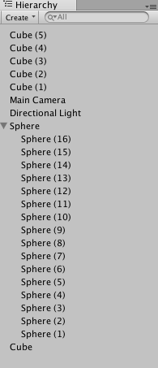
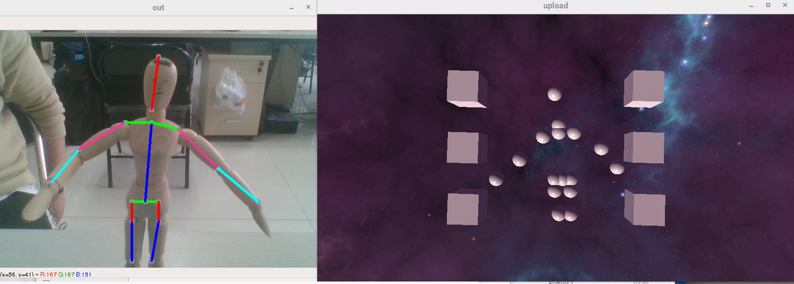

# MyPoseWithUnity3d
More detail pleas refer to my blog:https://blog.csdn.net/bobxx/article/details/88354697
using pose estimation result to control ball in unity3d
before use,please install tensorflow and opencv-python
when you create a nwe unity project, add 16 sphere object and use the Hierarchy below:





then adding the playerController.cs on the 16 spheres. You can add cube and add `move.cs` to it optionally.

When you prepare your unity sence, you can run the Recognition.py and wait some output:
```shell
python Recognition.py

```
the you can run your unity sence, the sphere will move along your joints.

